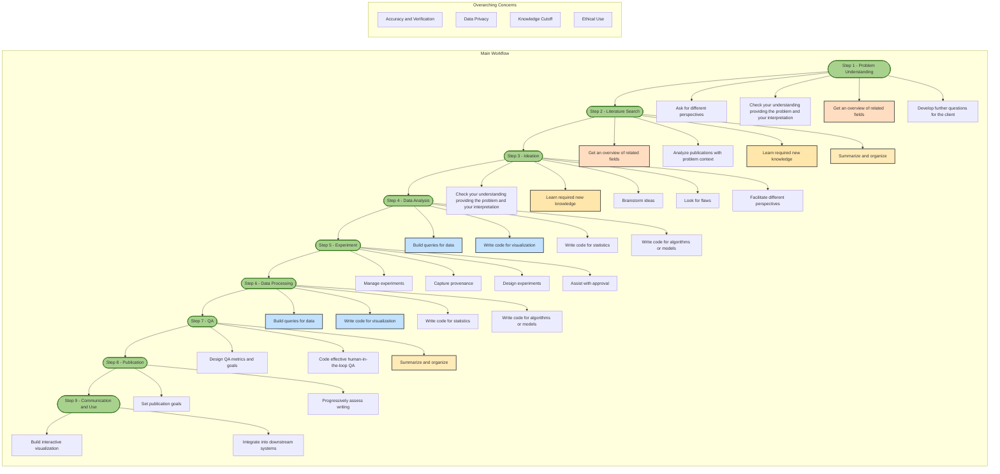

## Scientific Workflows

Scientific workflows here means the process in a science project of transforming inputs into value added delivered outputs. This process might be partly automated. A typical project might consist of understanding the problem, researching existing literature, developing new ideas and methods, analysing existing data, performing experiments, assuring quality and delivering science.

LLM are very general purpose and can help at many stages. Because LLM are new it's often the case that we may not immediately think to apply a LLM 

Throughout the process we can broadly catagorize different techniques:

## 1. General Thought Enhancement and Problem Understanding

**Utilizing LLMs can help better understand and work with complex knowledge** - An LLM typically has a comprehensive ability to understand and advise. LLMs can be overly vanilla, that is they may lack the ability to be very imaginative. This means that while an LLM might help you think of things you hadn't thought of it maybe constrained. It's important to critically assess the LLMs reasoning and understanding, add your own perspectives, critique the LLMs perspective and identify missing pieces. However, LLMs are also highly capable and it is valuable not to assume that you have already have a comprehensive and complete understanding. LLMs can often help refine existing knowledge and provide missing knowledge.  

**Ask for different perspectives** - LLMs can provide valueable critique and often illuminate ways of looking at problems and knowledge that might not be initially obvious. However LLMs can miss context easily and may provide perspectives not relevant to the context.  

**Check your understanding by providing the problem and your interpretation** - A powerful technique for working with LLMs is to rephrase or recontextualise learning and knowledge in your own words, that is producing an analogy, concrete use cases, implication or other synthesis of knowledge. LLMs can readily adapt to your interpretation and often provide good feedback on whether it is correct.  

**Get an overview of related fields** - LLMs have broad knowledge and can advise on a interconnected fields and knowledge however they may not be up to date with the latest research.  
Develop further questions for the client - LLMs can be useful in facilitating conversations, LLMs can help write and refine questions that help understand the science problem and assist in communicating with clients.  

**Analyze publications with problem context** - There are many emerging tools for analyzing literature with LLMs, LLMs can greatly accelerate the rate at which publications can be used. The downside is the fully subtly and context of a publication might be lost if LLMs are used for summarization or targeted analysis. There is also a risk an LLM is biased and miscontrues or misses important information.  

**Summarize and organize** - LLMs can be used to plan and summarize at many stages in the scientific process. They can be used to rapidly harmonize disorganised information and with humans in the loop reviewing can be a potential way to accelerate standardisation and metadata generation  

**Learn required new knowledge** - For a range of topics LLMs have good broad knowledge. Typically they can teach new skills effectively. Their knowledge of new knowledge or esoteric fields maybe limited or inaccurate.  

**Brainstorm ideas** - LLMs can be a good conversational partner when brainstorming ideas. Beware that they are often overly positive and may need to be instructed to be more critical  
Look for flaws - When specifically instructed LLMs maybe able to find flaws in documentation, existing literature, code, and methods.   

**Facilitate different perspectives** - LLMs can sometimes bring a new perspective when specifically instructed. They maybe biased though and not provide a comprehensive or diverse set of perspectives  

**Set publication goals** - LLMs to set predetermined publications goals.  

**Progressively assess writing** - With predetermined publication goals an LLM can progressively assess writing  

## 2. Coding and Data Analysis
   
**Build queries for data** - LLMs can build queries but caution should be exercised and it is best to understand the query the LLM has written to assure it is behaving as desired  

**Write code for visualization** - LLMs can speed up the ability to visualise data in different respects and are very good at using libraries like matplotlib in python  

**Write code for statistics** - LLMs have a broad knowledge of statistical techniques and can assist in writing statistical analysis  

**Write code for algorithms or models** - LLMs can be useful for writing algoirthms or models but generally for novel work must be carefully directed and assessed.  

## 3. Data Management, Experiment Design, and Provenance
   
**Manage experiments** - LLMs maybe able to manage experiment planning and execution with a human  

**Capture provenance** - LLMs can extract and formalize provenance information  

**Design experiments** - LLMs maybe able to help design and formalize experiments  

**Assist with approval** - LLMs might be able to assist in writing proposals and assist with understand and writing approvals  

## 4. Data Quality Assurance (QA) and Evaluation

**Design QA metrics and goals** - QA of data, process, and results can be improved with LLMs that can help establish and document metrics and goals.  

**Code effective human-in-the-loop QA** - Humans are critical in many QA processes but they can work together with LLMs to rapidly write and execute tests  

## 5. Communication and Integration

**Build interactive visualizations** - LLMs can do things like rapidly build an interactive website   

**Integrate into downstream systems** - Downstream systems might require a different data format an LLM can help write code to transform data for different integrations or maybe able to directly transform small ammounts of data  

